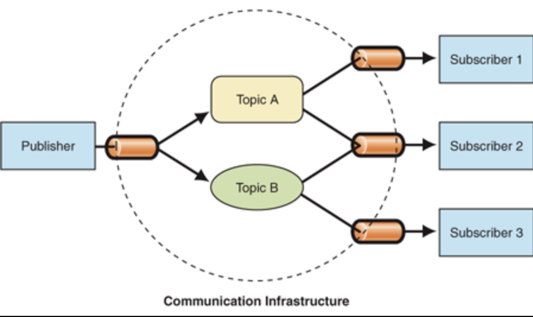
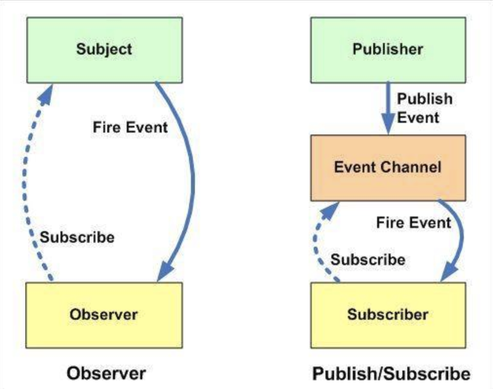

# 设计模式

## 观察者设计模式

观察者模式在软件设计中是一个对象，维护一个依赖列表，当任何状态发生改变自动通知它们。


## 发布-订阅设计模式

在观察者模式中的Subject就像一个发布者（Publisher），观察者（Observer）完全和订阅者（Subscriber）关联。subject通知观察者就像一个发布者通知他的订阅者。这也就是很多书和文章使用“发布-订阅”概念来解释观察者设计模式。但是这里还有另外一个流行的模式叫做发布-订阅设计模式。

> 在发布-订阅模式，消息的发送方，叫做发布者（publishers），消息不会直接发送给特定的接收者，叫做订阅者。



区别：



- 在观察者模式中，观察者是知道Subject的，Subject一直保持对观察者进行记录。然而，在发布订阅模式中，发布者和订阅者不知道对方的存在。它们只有通过消息代理进行通信。
- 在发布订阅模式中，组件是松散耦合的，正好和观察者模式相反。
- 观察者模式大多数时候是同步的，比如当事件触发，Subject就会去调用观察者的方法。而发布-订阅模式大多数时候是异步的（使用消息队列）。
- 观察者 模式需要在单个应用程序地址空间中实现，而发布-订阅更像交叉应用模式。

## Pubsub源码解读

- 在浏览器环境下使用，通过script标签来引入这个类库
- 通过NPM安装使用
- 兼容 ES6(ES2015) 的模块系统、CommonJS 和 AMD 模块规范

```
(function (root, factory){
    'use strict';

    var PubSub = {};
    
    //浏览器全局变量(root 即 window)
    root.PubSub = PubSub;
    
    var define = root.define;

    factory(PubSub);

    // AMD support
    if (typeof define === 'function' && define.amd){
        define(function() { return PubSub; });

        // CommonJS and Node.js module support
    } else if (typeof exports === 'object'){
        if (module !== undefined && module.exports) {
            exports = module.exports = PubSub; // Node.js specific `module.exports`
        }
        exports.PubSub = PubSub; // CommonJS module 1.1.1 spec
        module.exports = exports = PubSub; // CommonJS
    }

}(( typeof window === 'object' && window ) || this, function (PubSub){
    'use strict';

    var messages = {},
        lastUid = -1;
        
    //hasOwnProperty,判断一个对象是否具有给出名称的属性和对象    
    function hasKeys(obj){
        var key;

        for (key in obj){
            if ( obj.hasOwnProperty(key) ){
                return true;
            }
        }
        return false;
    }

    /**
     * Returns a function that throws the passed exception, for use as argument for setTimeout
     * @alias throwException
     * @function
     * @param { Object } ex An Error object
     */
    function throwException( ex ){
        return function reThrowException(){
            throw ex;
        };
    }

    function callSubscriberWithDelayedExceptions( subscriber, message, data ){
        try {
            subscriber( message, data );
        } catch( ex ){
            setTimeout( throwException( ex ), 0);
        }
    }

    function callSubscriberWithImmediateExceptions( subscriber, message, data ){
        subscriber( message, data );
    }

    function deliverMessage( originalMessage, matchedMessage, data, immediateExceptions ){
        var subscribers = messages[matchedMessage],
            callSubscriber = immediateExceptions ? callSubscriberWithImmediateExceptions : callSubscriberWithDelayedExceptions,
            s;

        if ( !messages.hasOwnProperty( matchedMessage ) ) {
            return;
        }

        for (s in subscribers){
            if ( subscribers.hasOwnProperty(s)){
                callSubscriber( subscribers[s], originalMessage, data );
            }
        }
    }

    function createDeliveryFunction( message, data, immediateExceptions ){
        return function deliverNamespaced(){
            var topic = String( message ),
                position = topic.lastIndexOf( '.' );

            // deliver the message as it is now
            deliverMessage(message, message, data, immediateExceptions);

            // trim the hierarchy and deliver message to each level
            while( position !== -1 ){
                topic = topic.substr( 0, position );
                position = topic.lastIndexOf('.');
                deliverMessage( message, topic, data, immediateExceptions );
            }
        };
    }

    function messageHasSubscribers( message ){
        var topic = String( message ),
            found = Boolean(messages.hasOwnProperty( topic ) && hasKeys(messages[topic])),
            position = topic.lastIndexOf( '.' );

        while ( !found && position !== -1 ){
            topic = topic.substr( 0, position );
            position = topic.lastIndexOf( '.' );
            found = Boolean(messages.hasOwnProperty( topic ) && hasKeys(messages[topic]));
        }

        return found;
    }

    function publish( message, data, sync, immediateExceptions ){
        message = (typeof message === 'symbol') ? message.toString() : message;

        var deliver = createDeliveryFunction( message, data, immediateExceptions ),
            hasSubscribers = messageHasSubscribers( message );

        if ( !hasSubscribers ){
            return false;
        }

        if ( sync === true ){
            deliver();
        } else {
            setTimeout( deliver, 0 );
        }
        return true;
    }

    /**
     * Publishes the message, passing the data to it's subscribers
     * @function
     * @alias publish
     * @param { String } message The message to publish
     * @param {} data The data to pass to subscribers
     * @return { Boolean }
     */
    PubSub.publish = function( message, data ){
        return publish( message, data, false, PubSub.immediateExceptions );
    };

    /**
     * Publishes the message synchronously, passing the data to it's subscribers
     * @function
     * @alias publishSync
     * @param { String } message The message to publish
     * @param {} data The data to pass to subscribers
     * @return { Boolean }
     */
    PubSub.publishSync = function( message, data ){
        return publish( message, data, true, PubSub.immediateExceptions );
    };

    /**
     * Subscribes the passed function to the passed message. Every returned token is unique and should be stored if you need to unsubscribe
     * @function
     * @alias subscribe
     * @param { String } message The message to subscribe to
     * @param { Function } func The function to call when a new message is published
     * @return { String }
     */
    PubSub.subscribe = function( message, func ){
        if ( typeof func !== 'function'){
            return false;
        }

        message = (typeof message === 'symbol') ? message.toString() : message;

        // message is not registered yet
        if ( !messages.hasOwnProperty( message ) ){
            messages[message] = {};
        }

        // forcing token as String, to allow for future expansions without breaking usage
        // and allow for easy use as key names for the 'messages' object
        var token = 'uid_' + String(++lastUid);
        messages[message][token] = func;
        
        // return token for unsubscribing
        return token;
    };

    /**
     * Subscribes the passed function to the passed message once
     * @function
     * @alias subscribeOnce
     * @param { String } message The message to subscribe to
     * @param { Function } func The function to call when a new message is published
     * @return { PubSub }
     */
    PubSub.subscribeOnce = function( message, func ){
        var token = PubSub.subscribe( message, function(){
            // before func apply, unsubscribe message
            PubSub.unsubscribe( token );
            func.apply( this, arguments );
        });
        return PubSub;
    };

    /**
     * Clears all subscriptions
     * @function
     * @public
     * @alias clearAllSubscriptions
     */
    PubSub.clearAllSubscriptions = function clearAllSubscriptions(){
        messages = {};
    };

    /**
     * Clear subscriptions by the topic
     * @function
     * @public
     * @alias clearAllSubscriptions
     */
    PubSub.clearSubscriptions = function clearSubscriptions(topic){
        var m;
        for (m in messages){
            if (messages.hasOwnProperty(m) && m.indexOf(topic) === 0){
                delete messages[m];
            }
        }
    };

    /**
     * Removes subscriptions
     *
     * - When passed a token, removes a specific subscription.
     *
	 * - When passed a function, removes all subscriptions for that function
     *
	 * - When passed a topic, removes all subscriptions for that topic (hierarchy)
     * @function
     * @public
     * @alias subscribeOnce
     * @param { String | Function } value A token, function or topic to unsubscribe from
     * @example // Unsubscribing with a token
     * var token = PubSub.subscribe('mytopic', myFunc);
     * PubSub.unsubscribe(token);
     * @example // Unsubscribing with a function
     * PubSub.unsubscribe(myFunc);
     * @example // Unsubscribing from a topic
     * PubSub.unsubscribe('mytopic');
     */
    PubSub.unsubscribe = function(value){
        var descendantTopicExists = function(topic) {
                var m;
                for ( m in messages ){
                    if ( messages.hasOwnProperty(m) && m.indexOf(topic) === 0 ){
                        // a descendant of the topic exists:
                        return true;
                    }
                }

                return false;
            },
            isTopic    = typeof value === 'string' && ( messages.hasOwnProperty(value) || descendantTopicExists(value) ),
            isToken    = !isTopic && typeof value === 'string',
            isFunction = typeof value === 'function',
            result = false,
            m, message, t;

        if (isTopic){
            PubSub.clearSubscriptions(value);
            return;
        }

        for ( m in messages ){
            if ( messages.hasOwnProperty( m ) ){
                message = messages[m];

                if ( isToken && message[value] ){
                    delete message[value];
                    result = value;
                    // tokens are unique, so we can just stop here
                    break;
                }

                if (isFunction) {
                    for ( t in message ){
                        if (message.hasOwnProperty(t) && message[t] === value){
                            delete message[t];
                            result = true;
                        }
                    }
                }
            }
        }

        return result;
    };    
}));
```
