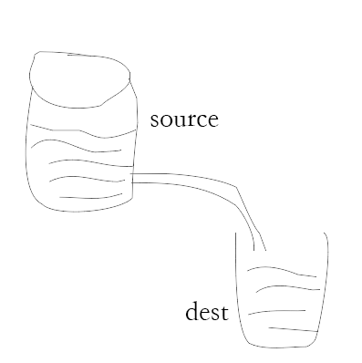

# nodejs中流(stream)的理解

## 什么是Stream（流）

>流（stream）在 Node.js 中是处理流数据的抽象接口（abstract interface）。 stream 模块提供了基础的 API 。使用这些 API 可以很容易地来构建实现流接口的对象。

防止处理二进制文件，比如音频、视频文件，避免内存“爆仓”。



Node.js 中有四种基本类型的流：可读流，可写流，双向流以及变换流。

- Readable - 可读流是对一个可以读取数据的源的抽象。fs.createReadStream 方法是一个可读流的例子。
- Writable - 可写流是对一个可以写入数据的目标的抽象。fs.createWriteStream 方法是一个可写流的例子。
- Duplex - 双向流既是可读的，又是可写的。TCP socket 就属于这种。
- Transform - 变换流是一种特殊的双向流，它会基于写入的数据生成可供读取的数据。例如使用 zlib.createGzip 来压缩数据。你可以把一个变换流想象成一个函数，这个函数的输入部分对应可写流，输出部分对应可读流。你也可能听说过变换流有时被称为 “thought streams”。

所有的流都是 EventEmitter 的实例。它们发出可用于读取或写入数据的事件。然而，我们可以利用 pipe 方法以一种更简单的方式使用流中的数据。

## 管道流(pipe)

```
  // 创建可读流
  const reader = fs.createReadStream(file.path);
  const fileId = uuidv4();
  const filePath = `${path.join(process.cwd(), 'upload')}/${fileId}.${file.name.split('.')[1]}`;
  // 创建可写流
  const upStream = fs.createWriteStream(filePath);
  // 可读流通过管道写入可写流
  reader.pipe(upStream);
    
  /**
    * 等到上传完毕在解锁
  */
  upStream.on('finish', () => {
    ...do something
  });
```

## 参考资料
- [Node.js 流: 你需要知道的一切](https://juejin.im/post/5940a9c3128fe1006a0ab176)
