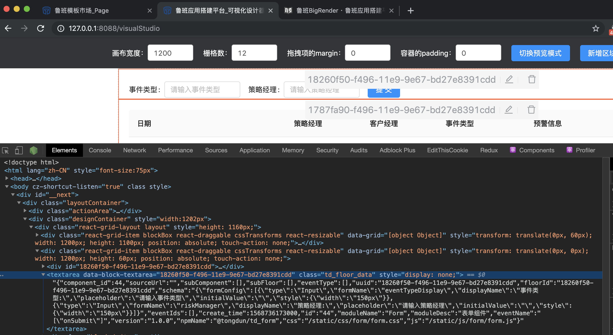

#  Bigrender介绍



```
<div id="18260f50-f496-11e9-9e67-bd27e8391cdd">React 挂载节点</div>

<textarea data-block-textarea="18260f50-f496-11e9-9e67-bd27e8391cdd" style="display: none;">
挂载节点的数据包
</div>
```

## BundleJS

18260f50-f496-11e9-9e67-bd27e8391cdd是BundleJS的挂载点，通过React工程开发完成的组件编译成一个JS束，在JS运行的时候动态挂载对应的区块。

```ReactDOM.render(<Root />, document.getElementById(blockId));```


## Bigrender区块

Bigrender区块用于存放组件束信息，UI Schema、Data Schema、取数逻辑、页面逻辑编排等信息。

```
{
    "component_id":44,
    "sourceUrl":"",
    "blockId":"18260f50-f496-11e9-9e67-bd27e8391cdd",
    "schema":"{"formConfig":[{"type":"Input","formName":"eventTypeDisplay","displayName":"事件类型:","placeholder":"请输入事件类型","initialValue":"","style":{"width":"150px"}},{"type":"Input","formName":"riskManager","displayName":"策略经理:","placeholder":"请输入策略经理","initialValue":"","style":{"width":"150px"}}]}",
    "blockData":"",
    "eventIds":[

    ],
    "create_time":1568736173000,
    "id":44,
    "moduleName":"Form",
    "moduleDesc":"表单组件",
    "version":"1.0.0",
    "npmName":"@tongdun/td_form",
    "css":"/static/css/form/form.css",
    "js":"/static/js/form/form.js"
}
```

