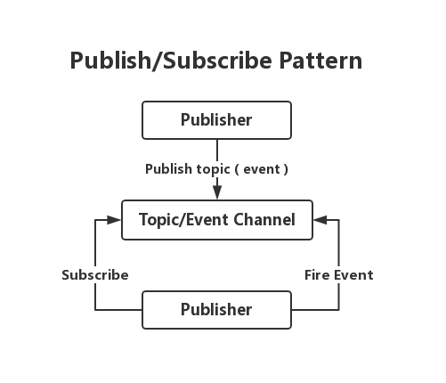
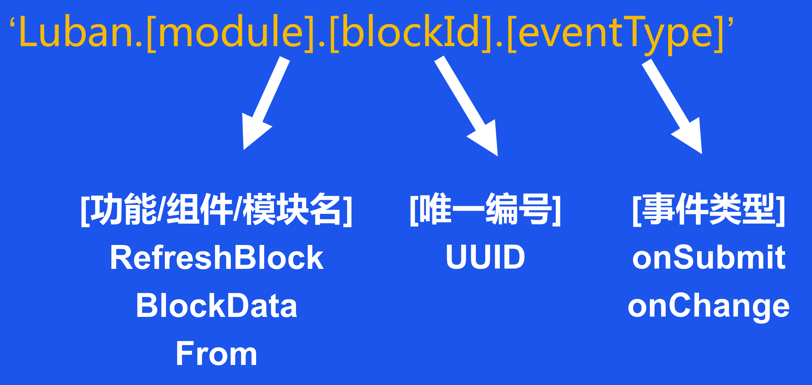

# 发布订阅模式

# pubsub-js API
| API | 功能 | 
| :------ | :------ | 
| subscribe | 订阅一个主题，并绑定事件处理函数 | 
| subscribeOnce | 订阅一个主题，执行一次后，立即注销订阅 |
| publish | 异步发布消息 |
| publishSync | 同步发布消息 |
| clearSubscriptions | 清空特定订阅主题 |
| clearAllSubscriptions | 清空所有订阅主题 |
| unsubscribe | 注销订阅特定主题 |

A.B.C.D

- A位:固定'Luban'
- B位:功能/模块/组件
- C位:UUID
- D位:事件类型

# 分层寻址
