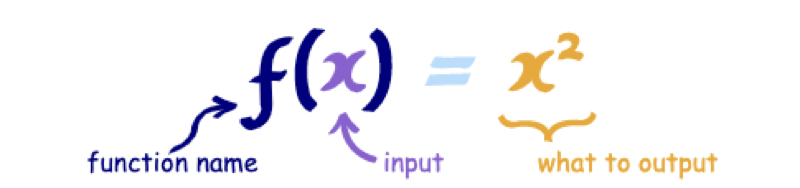

# 函数式编程 

简单说，"函数式编程"是一种"编程范式"（programming paradigm），也就是如何编写程序的方法论。

它属于"结构化编程"的一种，主要思想是把运算过程尽量写成一系列嵌套的函数调用。

- 与面向对象编程（Object-oriented programming）和过程式编程（Procedural programming）并列的编程范式。
- 最主要的特征是，函数是第一等公民。
- 强调将计算过程分解成可复用的函数，典型例子就是map方法和reduce方法组合而成 MapReduce 算法。
- 只有纯的、没有副作用的函数，才是合格的函数。

> <b>所谓柯里化就是把具有较多参数的函数转换成具有较少参数的函数的过程。</b>

涵盖了三个重要的概念：

- 纯函数
- 柯里化
- 高阶函数

## 函数拥有输入和输出

1、函数是什么

函数即是一种描述集合和集合之间的转换关系，输入通过函数都会返回有且只有一个输出值。

2、函数编程

函数实际上是一个关系，或者说是一种映射，而这种映射关系是可以组合的，一旦我们知道一个函数的输出类型可以匹配另一个函数的输入，那他们就可以进行组合。

我们需要处理的其实也只有“数据”和“关系”，而关系就是函数。我们所谓的编程工作也不过就是在找一种映射关系，一旦关系找到了，问题就解决了，剩下的事情，就是让数据流过这种关系，然后转换成另一个数据罢了。

3、流水线

数据可以不断的从一个函数的输出可以流入另一个函数输入。

4、工厂

函数式编程就是强调在编程过程中把更多的关注点放在如何去构建关系。通过构建一条高效的建流水线，一次解决所有问题。而不是把精力分散在不同的加工厂中来回奔波传递数据。

## 函数式编程的特点

- 函数是“一等公民” (First-Class Functions)
- 无状态和数据不可变 (Statelessness and Immutable data)
 - 数据不可变： 它要求你所有的数据都是不可变的，这意味着如果你想修改一个对象，那你应该创建一个新的对象用来修改，而不是修改已有的对象。
 - 无状态： 主要是强调对于一个函数，不管你何时运行，它都应该像第一次运行一样，给定相同的输入，给出相同的输出，完全不依赖外部状态的变化。 
 
- 没有副作用（No Side Effects）
- 纯函数 (pure functions)

## 参考资料
- [Pointfree 编程风格指南](http://www.ruanyifeng.com/blog/2017/03/pointfree.html)
- [函数式编程入门教程](http://www.ruanyifeng.com/blog/2017/02/fp-tutorial.html)
- [Ramda 函数库参考教程](https://www.ruanyifeng.com/blog/2017/03/ramda.html)
- [「译」理解JavaScript的柯里化](https://zhuanlan.zhihu.com/p/50247174)
- [JS专题之函数柯里化](https://zhuanlan.zhihu.com/p/55785190)
- [什么是函数式编程思维？](https://juejin.im/entry/59c654906fb9a00a4e67af25)
- [JS 函数式编程指南](https://llh911001.gitbooks.io/mostly-adequate-guide-chinese/content)
- [Ramda.js](https://ramda.cn)
- [函数式编程浅析](https://zhuanlan.zhihu.com/p/74777206)
- [简明 JavaScript 函数式编程——入门篇](https://juejin.im/post/5d70e25de51d453c11684cc4)
- [函数式编程进阶：杰克船长的黑珍珠号](https://juejin.im/post/5e09554bf265da33b5074d7f)
