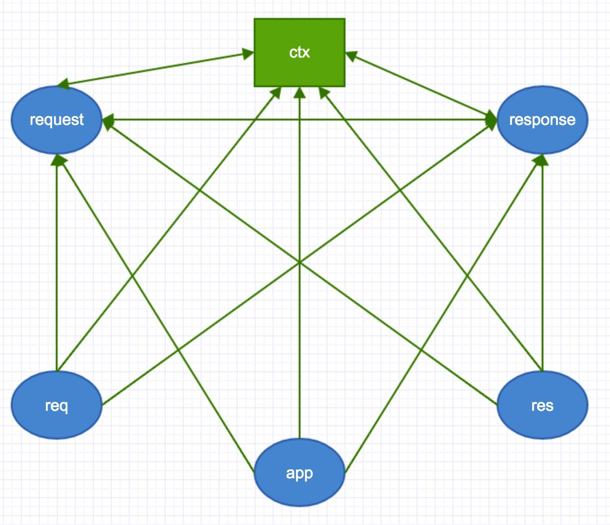

# 知识点

## 使用过的Koa2中间件


## 源码文件

```
├── lib
│   ├── application.js
│   ├── context.js
│   ├── request.js
│   └── response.js
└── package.json
```

核心代码就是lib目录下的四个文件

- application.js 是整个koa2 的入口文件，封装了context，request，response，以及最核心的中间件处理流程。
- context.js 处理应用上下文，里面直接封装部分request.js和response.js的方法
- request.js 处理http请求
- response.js 处理http响应

Koa.js 作为一个web框架，总结出来提供了两种能力

- 中间件机制（AOP切面）
- HTTP服务


Koa洋葱模型本质是AOP面向切面编程，切面由中间件机制实现，中间件单一职责，遵循先进后出的切面执行顺序，类似入栈出栈的顺序。

HTTP 切面流程（请求=>中间件=>响应） 从HTTP请求拿到想要的数据，然后处理想要处理的事情，最后返回处理后的结果

## koa流程


koa的流程分为三个部分：初始化 -> 启动Server -> 请求响应

- 初始化
 - 初始化koa对象之前我们称为初始化
- 启动server
 - 初始化中间件(中间件建立联系)
 - 启动服务,监听特定端口,并生成一个新的上下文对象
- 请求响应
 - 接受请求,初始化上下文对象
 - 执行中间件
 - 将body返回给客户端
 
- 初始化
 - 定义了三个对象，context, response, request
 
const ctx = this.createContext(req, res);创建一个最终可用版的context

 

- [从源码入手探索koa2应用的实现](https://zhuanlan.zhihu.com/p/43718629)
- [Koa洋葱模型与面向切面编程](https://chenshuyao.cn/2019/05/26/koajs.html)

## Koa-body原理

一个功能齐全的请求体解析器。支持multipart，urlencoded和json请求体。

```
{
  multipart: true, // 支持文件上传
  formidable: {
    maxFileSize: 200 * 1024 * 1024, // 设置上传文件大小最大限制，默认200M
  },
  formLimit: '200mb',
  jsonLimit: '5mb',
  textLimit: '5mb',
}
```

koa-body就是结合了koa-bodyparse和koa-multer，可以把GETPOST的参数解析到ctx.request.body中。

HTTP报文主要分为请求报文和响应报文，主要由以下三个部分组成：报文头部、空行、报文主体。

body-parser中间件返回promise，在执行了某些操作之后，把结果挂载到ctx.request.body上。

### Get参数获取

ctx.query/ctx.queryString，query返回是格式化好的参数对象，querystring返回的是请求字符串

### RESTful API 

ctx.params，GET /zoos：列出所有动物园

### Post参数获取

ctx.request.body

## 对Async、Await的理解，内部原理

async(声明一个异步函数):自动将常规函数转换成promise，返回值也是一个promise对象，只有async函数内部的异步操作执行完，才会执行then方法指定的回调函数，内部可以使用await；

await(暂停异步的功能执行):放在promise调用之前，await强制其他代码等待，直到promise完成并返回结果，只能与promise一起使用，不适用于回调，只能在async函数内部使用。

JavaScript对于异步操作有了终极解决方案。

async 函数是 Generator 函数的语法糖。使用关键字async来表示，在函数内部使用await来表示异步。

Async函数的改进在于下面四点：

- 内置执行器。Generator 函数的执行必须依靠执行器，而 Aysnc 函数自带执行器，调用方式跟普通函数的调用一样
- 更好的语义。async 和 await 相较于 * 和 yield 更加语义化
- 更广的适用性。co 模块约定，yield 命令后面只能是 Thunk 函数或 Promise对象。而 async 函数的 await 命令后面则可以是 Promise 或者 原始类型的值（Number，string，boolean，但这时等同于同步操作）
- 返回值是 Promise。async 函数返回值是 Promise 对象，比 Generator 函数返回的 Iterator 对象方便，可以直接使用 then() 方法进行调用

async 函数完美的解决了上面两种方式的问题。流程清晰，直观、语义明显。操作异步流程就如同操作同步流程。同时 async 函数自带执行器，执行的时候无需手动加载。

## 介绍下Promise，内部实现

Promise是一个状态机。初始是pending状态，可以通过函数resolve和reject ，将状态转变为 resolved 或者 rejected 状态，状态一旦改变就不能再次变化。

Promise是为了解决Javascript回调嵌套过多而产生的。因为支持链式调用，而且书写更加方便，被广大开发者喜爱并纳入了ES2015规范中，目前主流浏览器都支持Promise。

promise上面的方法：

- Promise.all方法用于将多个Promise实例，包装成一个新的Promise实例。相当于与Promise.all()
- Promise.race方法同样是将多个Promise实例，包装成一个新的Promise实例。相当于或Promise.race()
- 有时需要将现有对象转为Promise对象，Promise.resolve方法就起到这个作用。Promise.resolve()
- Promise.reject(reason)方法也会返回一个新的Promise实例，该实例的状态为rejected。Promise.reject()
- 捕捉错误，Promise.prototype.catch()
- finally 的回调总是会被执行，Promise.prototype.finally()
- 链式操作，Promise.prototype.then()

对象的状态不受外界影响，Promise存在三个互斥状态：pending、fulfilled、rejected。

Promise构造函数接收一个函数作为参数，这个传入的函数有两个参数，分别是两个函数 resolve和reject作用是，resolve将Promise的状态由未成功变为成功，将异步操作的结果作为参数传递过去；相似的是reject则将状态由未失败转变为失败


## 对跨域的了解

浏览器的同源策略会导致跨域，这里同源策略又分为以下两种

- DOM同源策略：禁止对不同源页面DOM进行操作。这里主要场景是iframe跨域的情况，不同域名的iframe是限制互相访问的。
- XmlHttpRequest同源策略：禁止使用XHR对象向不同源的服务器地址发起HTTP请求。只要协议、域名、端口有任何一个不同，都被当作是不同的域，之间的请求就是跨域操作。

### 跨域的解决方式

- CORS

CORS常用的配置项有以下几个：

 - Access-Control-Allow-Origin（必含） – 允许的域名，只能填 *（通配符）或者单域名。
 - Access-Control-Allow-Methods（必含） – 这允许跨域请求的 http 方法（常见有 POST、GET、OPTIONS）。
 - Access-Control-Allow-Headers（当预请求中包含 Access-Control-Request-Headers 时必须包含） – 这是对预请求当中 Access-Control-Request-Headers 的回复，和上面一样是以逗号分隔的列表，可以返回所有支持的头部。
 - Access-Control-Allow-Credentials（可选） – 表示是否允许发送Cookie，只有一个可选值：true（必为小写）。如果不包含cookies，请略去该项，而不是填写false。这一项与 XmlHttpRequest 对象当中的 withCredentials 属性应保持一致，即 withCredentials 为true时该项也为true；withCredentials 为false时，省略该项不写。反之则导致请求失败。
 - Access-Control-Max-Age（可选） – 以秒为单位的缓存时间。在有效时间内，浏览器无须为同一请求再次发起预检请求。

- JSONP

基本原理就是通过动态创建script标签,然后利用src属性进行跨域。

- 服务器代理

浏览器有跨域限制，但是服务器不存在跨域问题，所以可以由服务器请求所要域的资源再返回给客户端。服务器代理是万能的。

- postMessage

window.postMessage 是一个 HTML5 的 api，允许两个窗口之间进行跨域发送消息。

## TCP3次握手

3次握手，4次断开？

### 三次握手是怎么握的？


TCP是基于链接的，所以在传输数据前需要先建立链接，TCP在传输上是双工传输，不区分Client端与Server端，为了便于理解，我们把主动发起链接请求的一端称作Client端，把被动建立链接的一端称作Server端。

- 第一次握手

建立链接前需要Server端先监听端口，因此Server端建立链接前的初始状态就是LISTEN状态

Client端发送SYN同步包，Server端收到同步报，发送完成后Client端的链接状态变成SYN_SENT

- 第二次握手

Server端收到SYN同步包，同意建立链接，向Client端回复一个ACK。由于TCP是双工传输，Server端也会同时向Client端发送一个SYN，申请Server向Client方向建立链接。发送完ACK和SYN后，Server端的链接状态就变成了SYN_RCVD。

- 第三次握手

Client收到Server的ACK后，Client端的链接状态就变成了ESTABLISHED状态，同时，Client向Server端发送ACK，回复Server端的SYN请求。

Server端收到Client端的ack后，Server端的链接状态也就变成了的ESTABLISHED状态，此时建连完成，双方随时可以进行数据传输。

### 四次挥手是怎么挥的？


TCP链接的关闭，通信双方都可以先发起，这里我们以Client端先发起为例。

从图中看出，通信中Client端和Server端两端的链接都是ESTABLISHED状态，然后Client先主动发起了关闭链接请求，Client向Server发送了一个FIN包，表示Client端已经没有数据要发送了，然后Client进入了FIN_WAIT_1状态。

Server端收到FIN后，返回ACK，然后进入CLOSE_WAIT状态。此时Server属于半关闭状态，因为此时Client向Server方向已经不会发送数据了，可是Server向Client端可能还有数据要发送。

当Server端数据发送完毕后，Server端会向Client端发送fin，表示Server端也没有数据要发送了，此时Server进入LAST_ACK状态，就等待Client的应答就可以关闭链接了。

Client端收到Server端的FIN后，回复ACK，然后进入TIME_WAIT状态。TIME_WAIT状态下需要等待2倍的最大报文段生存时间，来保证链接的可靠关闭。之后才会进入CLOSED关闭状态。而Server端收到ACK后直接就进入CLOSED状态。

- TCP属于哪一层

第四层传输层

| OSI中的层 | 功能 | TCP/IP协议族 |
| :------| :------ | :------ | 
| 应用层 | 文件传输，电子邮件，文件服务，虚拟终端 | TFTP，HTTP，SNMP，FTP，SMTP，DNS，Telnet | 
| 表示层 | 数据格式化，代码转换，数据加密 | 没有协议 | 
| 会话层 | 解除或建立与别的接点的联系 | 没有协议 | 
| 传输层 | 提供端对端的接口 | TCP，UDP | 
| 网络层 | 为数据包选择路由 | IP，ICMP，RIP，OSPF，BGP，IGMP | 
| 数据链路层 | 传输有地址的帧以及错误检测功能 | SLIP，CSLIP，PPP，ARP，RARP，MTU | 
| 物理层 | 以二进制数据形式在物理媒体上传输数据 | ISO2110，IEEE802。IEEE802.2 | 

## [Bind、Call、Apply的区别](../knowledge/this.md)

## [介绍下原型链](../knowledge/prototype.md)

## this对象的深拷贝

## 函数防抖(debounce)

概念：在事件被触发n秒后再执行回调，如果在这n秒内又被触发，则重新计时。

生活中的实例：如果有人进电梯(触发事件)，那电梯将在10秒钟后出发(执行事件监听器)，这时如果又有人进电梯了(在10秒内再次触发该事件)，我们又得等10秒再出发(重新计时)。

## 函数节流(throttle)

概念：规定一个单位时间，在这个单位时间内，只能有一次触发事件的回调函数执行，如果在同一个单位时间内某事件被触发多次，只有一次能生效。

生活中的实例：当1秒内连续播放24张以上的图片时，在人眼的视觉中就会形成一个连贯的动画，所以在电影的播放(以前是，现在不知道)中基本是以每秒24张的速度播放的，为什么不100张或更多是因为24张就可以满足人类视觉需求的时候，100张就会显得很浪费资源。

[轻松理解JS函数节流和函数防抖](https://juejin.im/post/5a35ed25f265da431d3cc1b1)
