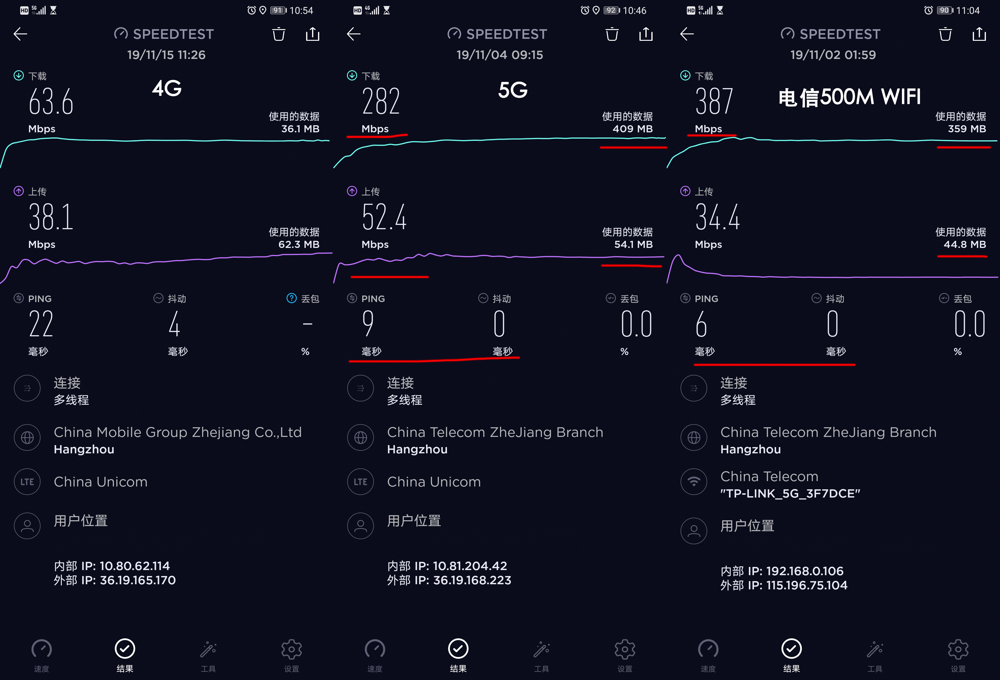
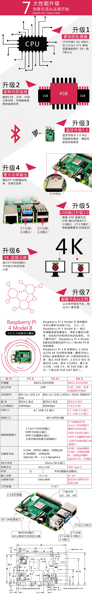

# 鲁班应用搭建平台，"5G+AI+IOT" 超级互联网时代一站式解决方案

>引言：4G改变生活，5G改变社会。随着中国三大国企电信运营商10月31日星期四宣布正式启动5G商用通信服务，标志着中国5G真正进入全民商用时代。5G+AI+IoT组成的超级互联网时代真正成为大众生活的一部分。回顾整个移动通信发展史，2G时代发短信是最时髦的通信方式，3G时代微信兴起，4G时代手机把衣食住行都“管起来”，那么5G将催生哪些“杀手级”应用？将对互联网产业产生哪些深远影响？

## 5G是什么？

5G是指第五代移动通信技术，具有高速率、低时延、高密度等特点，能支持更高效的信息传输、更快速的信号响应以及海量的终端接入。5G还有一个重要目标是通过新技术手段降低数据成本，这有助数据流量消费不断增加。

Mate 30 Pro 5G上市，作为首批用户我第一时间使用SPEEDTEST实测4G，5G，Wifi下各种网络表现。

### 低延时

5G 在网络延时和抖动上表现接近家庭500M的带宽的环境，我的5G速度不是全速，全速应该还会更快，一次测试耗流量500M。

低延时为各类传感器、机器人、自动驾驶车辆、虚拟现实等智能设备服务的网络。它将重新定义信息技术相关行业，从零售，交通运输、远程医疗、基础设施、工业制造等方面为社会发展和人类生活带来颠覆性变革，它产生的影响将不亚于电力和汽车。

### 高速率

5G将催生“瘦终端”。5G的超宽带使云端和本地已经没有差异了，许多应用可以放到云端，这将使终端更加简洁，“变瘦”的终端也会更便宜，使消费者节省了成本。

### 高密度

3G到4G的过渡主要体现在手机上。但对5G来说，手机和平板电脑只是很小一部分应用，更多的是高可靠、低时延、海量物联等场景，比如车联网、物联网、智慧城市、智能制造等，这些应用的普及会加速驱动技术的升级换代。

## AI

人工智能（Artificial Intelligence），英文缩写为AI。它是研究、开发用于模拟、延伸和扩展人的智能的理论、方法、技术及应用系统的一门新的技术科学。

## IOT

超级互联网时代，算力芯片和网络通讯技术的升级换代，5G又会给传统的开发带来新的挑战。树莓派（Raspberry Pi）基金会，2019年6月24日正式发布了Raspberry Pi 4 Model B 基于A72架构、4G LDDR4内存、支持千兆网络、双频802.11ac 无线网络、蓝牙5.0千兆网口。因此可以做物联网设备，也能进行一定量的运算，完全已经达到了今天入门级PC的水平。

“物联网”一词最早由 Kevin Ashton 在1999年提出。当时 Kevin 在宝洁公司从事供应链优化工作，他使用了一种新技术 RFID（射频识别），以此建立一个连接物体的无线网络。虽然现代的物联网主要是基于其他技术，Kevin 提出的物联网概念却依然得到广泛地采用，不断深入人心。

- 物联网将物理世界抽象到数字世界 (基于传感器的感知能力)
- 通过数据世界我们将重新认识物理世界 (基于新型网络协议的联网能力)
- 物理世界的数字化将变革人类的生产实践活动 (基于云数据和大计算的综合处理能力)

## GUI软件

从本质上讲，所有Web应用都是一种运行在网页浏览器中的软件，这些软件的图形用户界面（Graphical User Interface，简称GUI）即为前端。

如此复杂的Web应用，动辄几十上百人共同开发维护，其前端界面通常也颇具规模，工程量不亚于一般的传统GUI软件：

## 超级互联网时代的开发思考

### 端渲染回到云端渲染

5G的高速率让服务端渲染(SSR)重新焕发生机，把渲染放到后端，不仅是同构更关注端到端的服务交互，渲染优化等。

### 海量设备入网

大量的IOT设备入网，物理世界抽象到数字世界，将带来大量的中台建设需求。

(泛IOT架构)

(WeMos D1 mini NodeMCU)

### 算法

硬件能力的提升让我们可以在边缘设备上部署小型运算节点，将运算结果实时的回传云端。基于服务端，直接在Node层调用AI模型实现业务应用。

### 鲁班应用搭建平台

- 服务端渲染：基于Next.js
- 数据互联互通：在HTTP通信层面基于http-proxy-middleware的LubanProxy代理实现跨域和Cookie请求携带。Java语言RPC基于Dubbo2.js，其他语言RPC基于Google GPRC
- 模型能力调用：在AI层面基于opencv4nodejs实现了对模型的直接调用，基于tesseract实现ORC的能力

[测测你最像那位名人](https://x.tongdun.cn/ai)

## 参考资料

- [开发板界的「瑞士军刀」—— 树莓派 4 轻体验](https://sspai.com/post/56452)
- [前端工程——基础篇](https://github.com/fouber/blog/issues/10)
